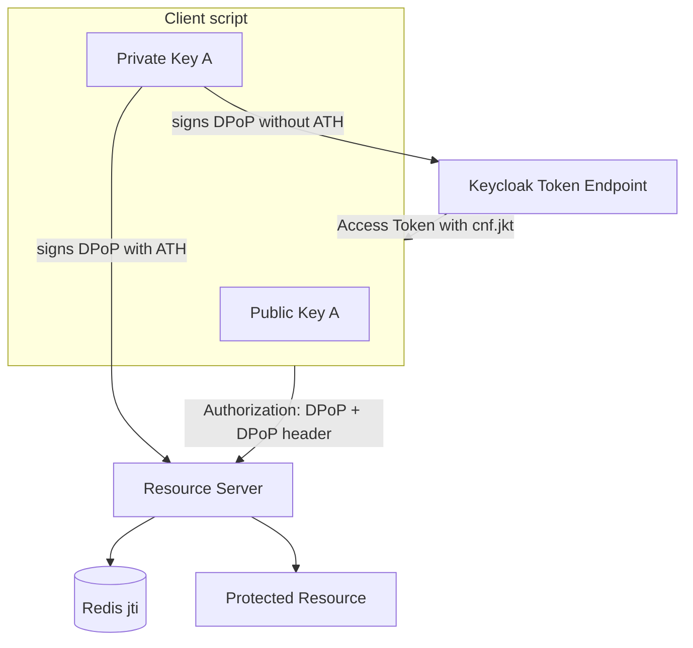
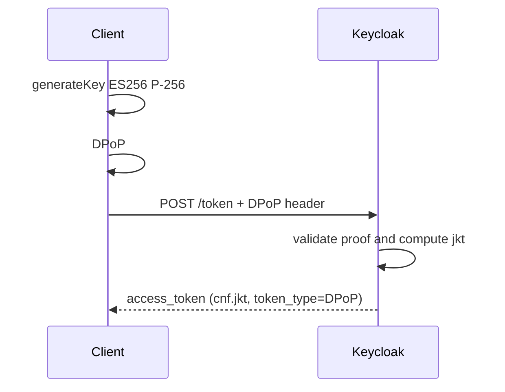
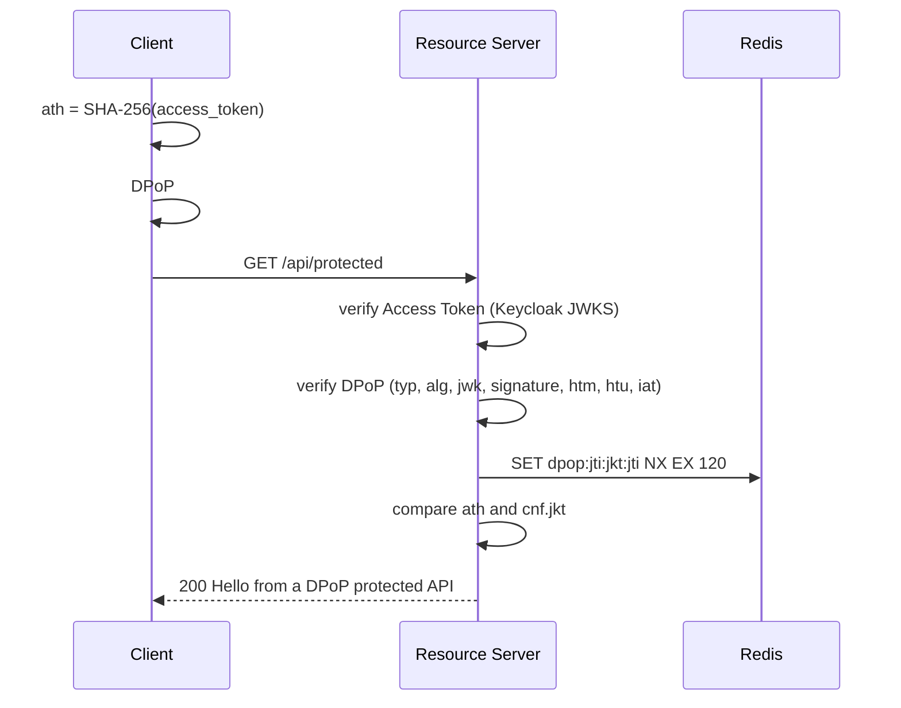

# DPoP Demo — OAuth 2.0 Demonstration of Proof-of-Possession

A small **Resource Server** that teaches **DPoP (RFC 9449)**:

- Keycloak issues a **sender-constrained** Access Token with `cnf.jkt`;
- this server validates that token **and** a fresh DPoP Proof on every call;
- Redis prevents replay of the same `jti`.

The OAuth client is not a separate app. It lives in `demo/` (a walkthrough you can run) and `test/e2e/` (the same flow as assertions). Both share `demo/dpop-client.ts`.

This is not production-grade. The point is to make every piece of the protocol visible.

```text
Keycloak  26.7.3   localhost:8080
Redis     7.4      localhost:6379
Server             localhost:3000
```

---

## 1. What is DPoP

**DPoP** (_Demonstration of Proof-of-Possession_) changes the Access Token model from:

```text
Bearer  =  whoever holds the token can use it
```

to:

```text
Sender-constrained  =  only someone who holds the token AND the matching private key can use it
```

The client generates an asymmetric key pair and, on every relevant HTTP request, sends a short JWT in the `DPoP` header. That JWT is the **DPoP Proof**. It is signed with the private key and contains:

| Claim | Role                                                |
| ----- | --------------------------------------------------- |
| `htu` | HTTP URI of the request (no query/fragment)         |
| `htm` | HTTP method (`GET`, `POST`, …)                      |
| `iat` | creation time                                       |
| `jti` | unique proof identifier                             |
| `ath` | hash of the Access Token (only once a token exists) |

The Authorization Server (Keycloak here) computes the public-key _thumbprint_ (RFC 7638) and embeds it in the Access Token:

```json
{
  "cnf": {
    "jkt": "<JWK thumbprint>"
  }
}
```

The Resource Server compares `cnf.jkt` with the thumbprint of the key that signed the DPoP Proof. If an attacker steals only the Access Token, they cannot produce a valid proof.

---

## 2. What problem DPoP solves

`Bearer` Access Tokens leak often:

- proxy / API gateway logs;
- XSS in SPAs;
- browser extensions;
- memory dumps;
- headers copied from DevTools.

With a Bearer token, **holding the token is enough**. DPoP does not stop leakage, but it makes the token useless without the private key that never leaves the client.

That matters most for **public clients** (CLIs, SPAs, mobile apps), which cannot store a client secret safely.

---

## 3. Project architecture

```text
/
├── src/                    Resource Server (Fastify + jose + Redis)
│   └── dpop/               explicit DPoP validations
├── demo/                   example OAuth client (not a product)
│   ├── dpop-client.ts      keys + proofs via `dpop`, token + API calls
│   └── index.ts            printed walkthrough (`yarn demo`)
├── test/                   unit tests for the validation layer
│   └── e2e/                Keycloak + Redis + this server
├── keycloak/               realm import (not a third application)
│   └── realm-export.json
├── docker-compose.yml      Keycloak 26.7.3 + Redis 7.4
├── README.md
└── .env.example
```



There are no extra microservices. Keycloak issues the token; this repository **is** the Resource Server.

---

## 4. Login flow

This demo uses **Resource Owner Password Credentials** only so the Token Endpoint stays in `demo/` / e2e. In production a user-facing app should use **Authorization Code + PKCE**. DPoP at the Token Endpoint is the same in both cases.

```text
1. Client generates Private Key A / Public Key A   (ES256, P-256)
2. Client generates DPoP #1
     htu = http://localhost:8080/realms/dpop-demo/protocol/openid-connect/token
     htm = POST
     iat, jti
     NO ATH
3. Client POST /token
     DPoP: DPoP #1
4. Keycloak validates the proof
5. Keycloak computes thumbprint(Public Key A)
6. Keycloak issues an Access Token with cnf.jkt = that thumbprint
```



### Official Keycloak 26.7.3 configuration

DPoP has been a **supported feature since Keycloak 26.4** (it was preview before that). There is no feature flag to turn on.

In the Admin Console: **Clients → dpop-client → Settings → Capability config → Require DPoP bound tokens**.

In the realm import that is the official client attribute:

```json
"attributes": {
  "dpop.bound.access.tokens": "true"
}
```

That attribute maps to the `dpop_bound_access_tokens` client metadata from the DPoP specification.

- **on:** every Token Request **must** include a valid DPoP Proof; the token is sender-constrained.
- **off:** the client _may_ send DPoP; if it does, Keycloak still binds the token with `cnf.jkt`.

There is also a Client Policy executor, `dpop-bind-enforcer`, for advanced policies (for example binding only the refresh token). This demo uses the client switch, which is the documented way to require DPoP.

Docs: [Securing applications with DPoP](https://www.keycloak.org/securing-apps/dpop).

---

## 5. Why login has no `ath`

`ath` is the SHA-256 (base64url) hash of the Access Token.

At the Token Endpoint **there is no Access Token yet**. Including `ath` there would not make sense: there is nothing to hash.

The client code states that explicitly:

```ts
// There is no ATH here because an Access Token does not exist yet.
// ATH is only included when the DPoP proof accompanies an
// authenticated request containing an Access Token.
```

---

## 6. Protected API flow

```text
7.  Client wants GET /api/protected
8.  Client computes ath = base64url(SHA-256(access_token))
9.  Client generates DPoP #2
      htu = http://localhost:3000/api/protected
      htm = GET
      iat, jti, ath
10. Client signs DPoP #2 with Private Key A
11. Client sends
      Authorization: DPoP <access_token>
      DPoP: <DPoP #2>
12–20. Server validates token, proof, htu/htm/iat/jti, Redis, ath, cnf
21. 200 OK
```

The scheme is **not** `Bearer`. DPoP-bound tokens must travel as:

```http
Authorization: DPoP eyJhbGciOiJSUzI1NiIsInR5cCIgOiAiSldUIi...
DPoP: eyJ0eXAiOiJkcG9wK2p3dCIsImFsZyI6IkVTMjU2Ii...
```



---

## 7. Anatomy of the DPoP Proof and the Access Token

### `typ`

JOSE header. **Required:** `dpop+jwt`. Distinguishes the proof from a regular Access Token.

### `alg`

This demo accepts only `ES256`. `none`, HMAC, and any other algorithm are rejected **before** signature verification. The header `alg` is attacker-controlled until the signature is checked, so the allow-list comes first.

### `jwk`

The **public** key in the proof header. Never the private key (`d`, `p`, `q`, `k`, …). In this demo: `kty=EC`, `crv=P-256`, coordinates `x`/`y`.

Extracting the JWK proves nothing. Anyone can copy a public key into a header. The **signature** proves possession of the private key.

### `htu`

HTTP URI of the request, **without query and fragment**. Scheme and host are compared case-insensitively; default ports (`:80`, `:443`) are omitted; the path is case-sensitive.

Do not use `proof.htu === request.url`. In most frameworks `request.url` is only path + query, and proxies rewrite scheme/host/port.

This server compares `htu` against `RESOURCE_SERVER_PUBLIC_URL` + path. That avoids blindly trusting `Host` / `X-Forwarded-*`.

Common `htu` pitfalls:

| Situation                    | What breaks                                                      |
| ---------------------------- | ---------------------------------------------------------------- |
| Reverse proxy terminates TLS | client sends `https://…`, server sees `http://…`                 |
| Gateway changes the host     | `api.example.com` vs `server.internal`                           |
| Explicit vs default port     | `https://host:443/x` vs `https://host/x`                         |
| Query string                 | `htu` does not include `?foo=bar`; the server must ignore it too |
| URL rewriting                | `/api/v1/x` on the client becomes `/x` upstream                  |
| `localhost` vs `127.0.0.1`   | different hosts → invalid HTU                                    |

### `htm`

HTTP method in uppercase. `proof.htm = POST` with `request.method = GET` is invalid.

### `iat`

Unix timestamp. Accepted only within `DPOP_IAT_TOLERANCE_SECONDS` (default ±60s). Outside the window: `401 DPoP proof expired`.

### `jti`

Unique identifier (`crypto.randomUUID()` on the client). Missing `jti`: rejected. Same `jti` with the same key: replay.

### `ath`

```text
SHA-256(access_token)  →  Base64URL
```

The Access Token itself is **never** placed inside the proof. `ath` binds this proof to **this** token: a captured proof cannot be pasted onto another token.

The server comparison is timing-safe.

### `cnf.jkt`

A claim on the **Access Token**, not on the DPoP proof.

```text
Access Token
     |
     v
  cnf.jkt  ----+
               |
               v
         Public Key A  <---- DPoP header.jwk
               ^
               |
         DPoP signature
               |
               v
         Private Key A
```

This is the check that separates Bearer from sender-constrained. Stolen token + new key = `dpop_key_mismatch`.

---

## 8. How the Access Token is bound to the key

```text
public JWK  →  RFC 7638 canonical JSON  →  SHA-256  →  Base64URL  →  jkt
```

For EC, the canonical JSON contains only `crv`, `kty`, `x`, `y` in lexicographic order.

The client computes that value when it generates the key. After login, the Access Token payload must show the **same** `cnf.jkt`. The script prints both values and whether they match.

---

## 9. Replay protection

An intercepted DPoP Proof could be resent while `iat` is still inside the window. That is why every proof has a one-time `jti`.

Flow:

1. Signature, `htu`, `htm`, and `iat` have already been validated.
2. The server tries to record `(jkt, jti)`.
3. First time: accept.
4. Second time: `401` / `dpop_replay_detected`.

The **Replay Last Request** button resends the exact same `Authorization` + `DPoP`, without generating a new `jti`. The first GET should be `200`; the replay, `401`.

---

## 10. How Redis is used

```text
SET dpop:jti:<jkt>:<jti> 1 NX EX 120
```

- `NX` — write only if the key does not already exist.
- `EX 120` — TTL near the `iat` window (±60s ⇒ 120s covers the edge of the window).
- Return `OK` → MISS → new request.
- Return `null` → HIT → replay.

`jkt` is part of the Redis key for namespacing: `jti` is unique **per public key**.

---

## 11. How to run the project

Prerequisites: Docker, Node.js **24.16.0** (see `.nvmrc`), Yarn 1.

```bash
# 1. Infrastructure
docker compose up -d

# Keycloak start-dev takes ~30–60s on the first boot.
# Admin console: http://localhost:8080  (admin / admin)
# Imported realm: dpop-demo
# Demo user: alice / alice

# 2. Install
yarn install

# 3. Resource Server
yarn dev
```

Copy `.env.example` to `.env` if you need to override defaults.

### Demo client

With Keycloak, Redis, and `yarn dev` running:

```bash
yarn demo
```

`demo/index.ts` generates keys, requests a token from Keycloak, calls `GET /api/protected`, then replays that request and tries the same token with a different key. It prints the JWTs so you can inspect `ath` and `cnf.jkt`.

Proofs are built with [`dpop`](https://www.npmjs.com/package/dpop) (`generateKeyPair`, `generateProof`, `calculateThumbprint`). The Resource Server still validates every claim itself in `src/dpop/`.

### Validation-layer tests

These do not need Keycloak or Redis: the functions take a local JWKS and an in-memory `ReplayStore`.

```bash
yarn test
```

### End-to-end tests

Needs Docker (Keycloak + Redis). The test process starts this server itself — you do not need `yarn dev`.

```bash
docker compose up -d
yarn test:e2e
```

### Commit messages

Commits use [Conventional Commits](https://www.conventionalcommits.org/) and **must include a scope**. Lefthook runs `yarn commit-lint` on `commit-msg`, and `format:check`, `lint:check`, and `type-check` on `pre-commit`.

```text
feat(server): add DPoP HTU comparison
fix(client): omit ath on the token request
docs(readme): explain cnf.jkt
```

Invalid (no scope):

```text
feat: add DPoP HTU comparison
```

---

## 12. How to test a Replay Attack

1. Start Keycloak, Redis, and the Resource Server.
2. Run `yarn demo`.
3. Step 3 (`GET /api/protected`) should print `200` and `{"message":"Hello from a DPoP protected API"}`.
4. Step 4 (replay) should print `401` and `{"error":"dpop_replay_detected"}`.

In the server terminal:

```text
✗ Replay protection
  Redis: HIT
```

---

## 13. How to test a stolen Access Token

`yarn demo` logs in (token bound to **Key A**), then step 5 generates **Key B**, signs a new DPoP proof with B, and reuses the Access Token from A.

Expected: `401` and `{"error":"dpop_key_mismatch"}`.

```text
Access Token.cnf.jkt  =  thumbprint(Key A)
DPoP header.jwk       =  Key B
thumbprint(B) ≠ A  →  rejected
```

That is the visual difference between Bearer and sender-constrained: the token alone does not authenticate.

---

## 14. How to inspect the JWTs

The client script prints the raw JWT and the decoded JSON.

You can also paste the token or proof into [jwt.io](https://jwt.io) (read-only). A DPoP Proof looks like:

```json
{
  "typ": "dpop+jwt",
  "alg": "ES256",
  "jwk": { "kty": "EC", "crv": "P-256", "x": "…", "y": "…" }
}
```

On login, the payload has **no** `ath`. On the API call, it does.

The Access Token (signed by Keycloak, usually RS256) should contain:

```json
{
  "iss": "http://localhost:8080/realms/dpop-demo",
  "aud": "dpop-api",
  "cnf": { "jkt": "…" }
}
```

`token_type` in the Token Endpoint response should be `DPoP`, not `Bearer`.

---

## 15. Resource Server validations

Order in `src/dpop/verify-dpop.ts`:

1. `Authorization: DPoP` scheme (Bearer is rejected)
2. Access Token signature via Keycloak JWKS
3. `iss`, `aud`, `exp`, `nbf`
4. `typ = dpop+jwt`
5. `alg = ES256`
6. Public EC P-256 JWK, no private parameters
7. DPoP signature
8. `htm`
9. `htu` (normalized URI)
10. `iat` ± tolerance
11. `jti` present
12. Redis `SET NX`
13. `ath`
14. `cnf.jkt` == thumbprint(`header.jwk`)

In development the server prints every step (`DPOP_VERBOSE=true`):

```text
[DPoP] Validating request

✓ Access Token signature
✓ issuer
✓ audience
✓ expiration

✓ typ = dpop+jwt
✓ alg = ES256
✓ DPoP signature

✓ HTM
  expected: GET
  received: GET

✓ HTU
  expected: http://localhost:3000/api/protected
  received: http://localhost:3000/api/protected

✓ IAT
  age: 2s

✓ JTI
  817417cb-...

✓ Replay protection
  Redis: MISS

✓ ATH
  expected: z4...
  received: z4...

✓ CNF
  token jkt:    AbCd...
  proof jkt:    AbCd...

--------------------------------

DPoP validation succeeded
```

---

## 16. Full flow

```text
1.  Client generates Private Key A / Public Key A
2.  Client generates DPoP #1 (token endpoint, POST, no ATH)
3.  Client POST /token with DPoP header
4.  Keycloak validates DPoP
5.  Keycloak computes thumbprint(Public Key A)
6.  Keycloak issues Access Token with cnf.jkt
7.  Client wants GET /api/protected
8.  Client computes ath = SHA-256(access_token)
9.  Client generates DPoP #2 (API htu, GET, with ath)
10. Client signs DPoP #2 with Private Key A
11. Client sends Authorization: DPoP + DPoP header
12. Server validates Access Token
13. Server validates DPoP signature
14. Server validates HTU
15. Server validates HTM
16. Server validates IAT
17. Server checks JTI in Redis
18. Server validates ATH
19. Server computes thumbprint(DPoP.header.jwk)
20. Server compares AccessToken.cnf.jkt with that thumbprint
21. Request accepted
```

---

## 17. Limitations of this example

- Password grant instead of Authorization Code + PKCE. It is here to teach DPoP at the Token Endpoint without a browser; **do not** use it in a real user-facing app.
- The private key lives only in process memory for that demo or e2e run.
- One Resource Server, one client, one user (`alice` / `alice`).
- No DPoP nonce (`DPoP-Nonce`). Replay is mitigated with `jti` + Redis, not a server challenge.
- The client does not refresh tokens.
- `htu` uses a configured public URL (`RESOURCE_SERVER_PUBLIC_URL`), not magical discovery behind a proxy.
- Keycloak `start-dev` + H2: fine for study, not for production.
- Admin credentials (`admin` / `admin`) and the demo user are intentionally obvious.

None of that relaxes the cryptographic checks: signature, algorithm, `cnf`, `ath`, and replay stay on.

---

## References

- [RFC 9449 — OAuth 2.0 Demonstrating Proof of Possession (DPoP)](https://www.rfc-editor.org/rfc/rfc9449.html)
- [RFC 7638 — JSON Web Key (JWK) Thumbprint](https://www.rfc-editor.org/rfc/rfc7638.html)
- [Keycloak 26.7 — Securing applications with DPoP](https://www.keycloak.org/securing-apps/dpop)
- [Keycloak 26.4 — DPoP became a supported feature](https://www.keycloak.org/2025/10/dpop-support-26-4)
